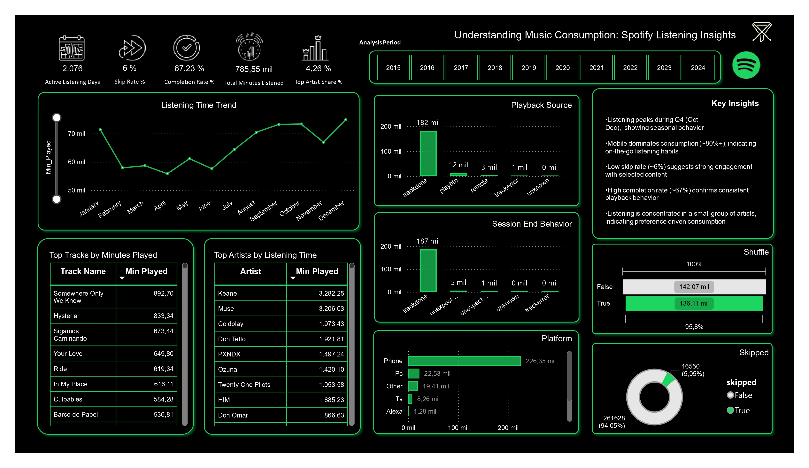

# Spotify User Behavior & Engagement Analysis

> **Author:** Pablo Rodriguez  
> **Connect:** [LinkedIn](https://www.linkedin.com/in/pablo-alejandro-rodriguez-camargo/)

---

### Overview
This project analyzes Spotify listening data to uncover user behavior patterns, engagement levels, and music consumption trends.

The workflow combines Python for data processing and Power BI for interactive visualization, transforming raw listening data into meaningful insights.

---

### Objective
To understand how users interact with music by analyzing:

- Listening behavior over time  
- Engagement metrics (skip rate & completion rate)  
- Platform usage patterns  
- Artist concentration and preferences  

---

### Dashboard Preview

---

### Key Insights

- Listening peaks during Q4 (October–December), indicating seasonal behavior  
- Mobile devices dominate usage (~80%+), showing strong on-the-go consumption  
- Low skip rate (~6%) suggests high engagement with selected content  
- High completion rate (~67%) confirms consistent playback behavior  
- Listening is concentrated among a small group of artists  

---

### Key Metrics

- Total Minutes Listened  
- Active Listening Days  
- Skip Rate (%)  
- Completion Rate (%)  
- Top Artist Share (%)  

---

### Data Processing Workflow

1. Combine multiple Spotify JSON files into a single dataset  
2. Clean and transform data using Python  
3. Create derived variables (time, content type, platform grouping)  
4. Export a cleaned dataset for Power BI  
5. Build an interactive dashboard  

---

### Repository Structure

spotify-user-behavior/
│
├── data/
│   ├── raw/
│   └── processed/
│
├── notebooks/
│   └── spotify_analysis.ipynb
│
├── dashboard/
│   └── spotify_dashboard.pbix
│
├── assets/
│   └── dashboard.jpg
│
├── README.md
├── requirements.txt
└── gitignore

---

### Power BI Data Source Setup

The Power BI dashboard uses the cleaned dataset generated by the Python notebook.

File generated:
data/processed/spotify_list_clean.csv

How to connect it:

1. Run the notebook to generate the dataset  
2. Open the .pbix file in the dashboard folder  
3. Go to Transform Data  
4. Update the CSV file path if needed  
5. Refresh the model  

Note:
Power BI Desktop relies on local file paths. If the project is moved, the data source must be updated manually.

---

### Tools & Technologies

- Python (Pandas, NumPy)  
- Power BI  
- Data Cleaning & Transformation  
- Exploratory Data Analysis  

---

### Key Takeaway

This project shows how behavioral data can be transformed into actionable insights, enabling a deeper understanding of user engagement and music consumption patterns.
